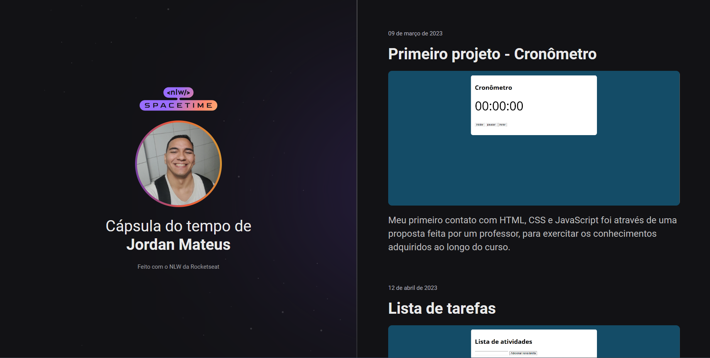

  

## 🖥️ Projeto
Esse é um projeto Web Responsivo, de uma cápsula do tempo para exibir a minha evolução ao longo do tempo com a programação.

## 🚀 Tecnologias
Esse projeto foi desenvolvido durante o NLW da Rocketseat com as seguintes tecnologias:

- HTML
- CSS
- Git e Github
